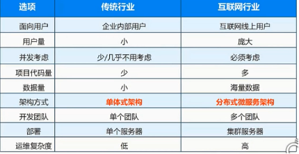
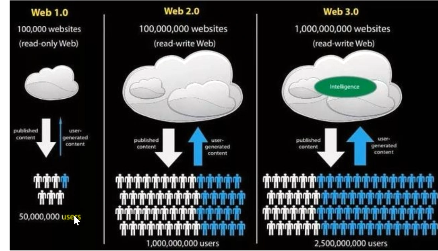
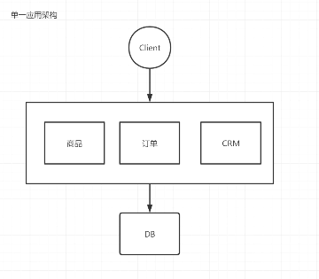
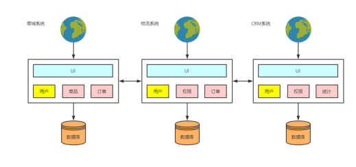
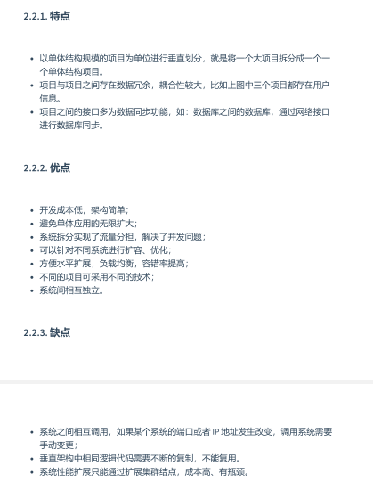
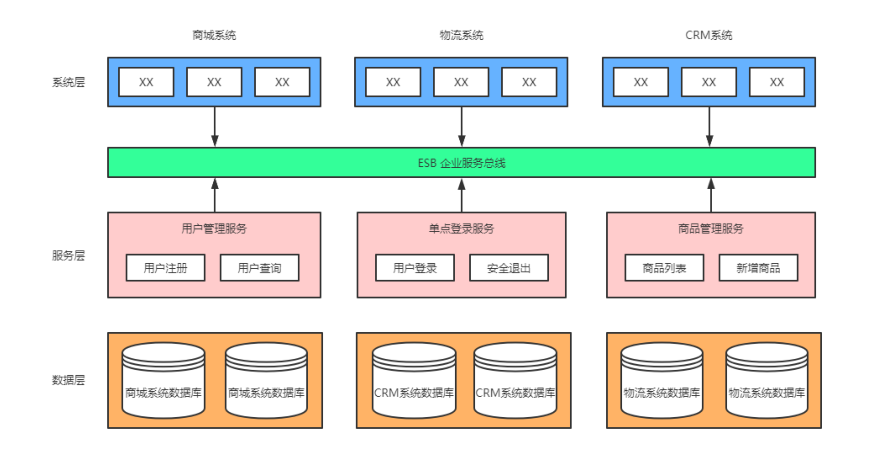
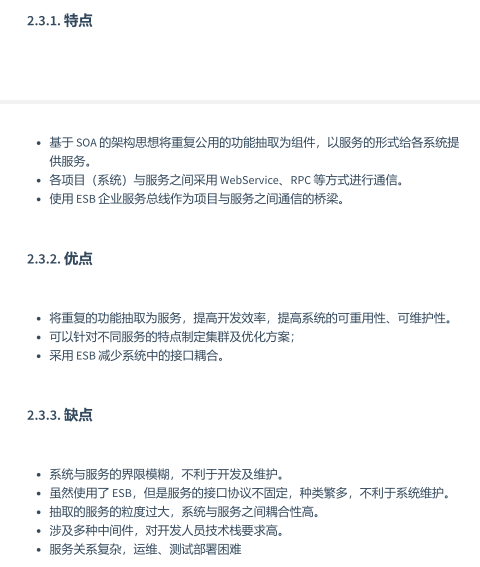
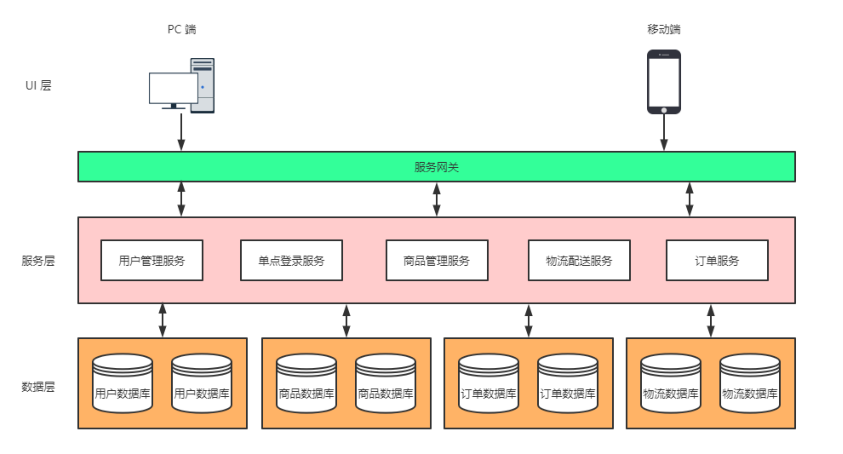
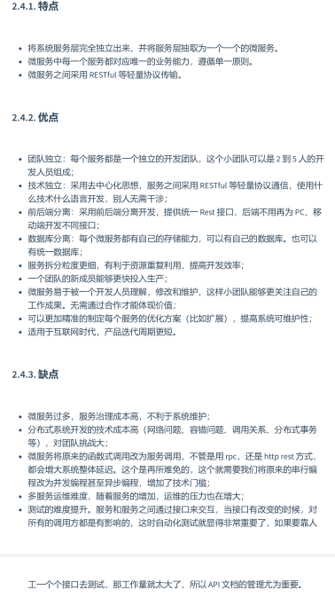

# 微服务架构的前世今生

## 1.传统行业向互联网行业的转型

2012年，移动联网兴起

2014年，微服务的概念传入中国

### 1.2.传统行业与互联网行业的区别

### 1.3.互联网发展史

web1.0 相当于新闻 ；只能看

web2.0 相当于微博；可以看各种分析，点评

web3.0 重点为数据分析；直接推荐你需要什么

## 2.技术架构的演变

### 2.1.单一应用架构

优点： 开发简单；便与共享；易于测试；容易部署

缺点：妨碍持续交付；不够灵活；受技术栈限制；可靠性差；伸缩性差；技术债务：需要看别人写的代码

### 2.2.垂直应用架构

拆分的是整个大的业务，代码中的小业务重复较高

### 2.3.SOA面向服务架构

### 🤑2.4.微服务架构

前后端分离的服务，将所有服务全部分割出来，对于前台来说需要写死地址，

保留SOA的优点esb，设置网关，

## 🤑🤩3.微服务设计原则

## 🤑4.CAP原则与BASE理论

## 😴5.微服务架构带来的问题

## 6.微服务架构生态系统

## 7.微服务架构技术支持

