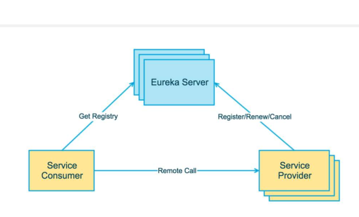
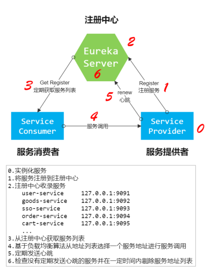

# Eureka注册中心

`在微服务思想中`，对项目进行拆分，拆分后的每个模块都会在一个服务器上独立的运行，虽然解决了一些单体项目所带来的的诸多瓶颈，但是又有一个新的问题产生，就是模块与模块之间的调用，一个模块的使用可能需要依赖很多模块，正常在A服务调用B服务时需要将地址写"死"，如果B服务的需求变大要进行集群化部署，那么A就需要修改，所以耦合度是非常高的。这时候就需要引入注册中心，它的存在完美的解决了这种高耦合的弊端。`
        本节课学习的 Eureka，它记录了服务和服务地址的映射关系。在分布式架构中，服务会注册到这里，当服务需要调用其它服务时，就到这里找到服务的地址，进行调用。` 

## 🤑1.重点掌握

### 1.1.注册中心的概念及用途

注册中心，有的书上也叫做“服务中心”，一个完整的微服务系统需要注册中心来统一治理各个服务。注册中心为什么叫注册中心呢？首先，各个微服务在启动的时候，将自己的网络地址等信息注册到注册中心，注册中心存储这些数据。然后，若微服务之间有通信时，服务消费者从注册中心查询服务提供者的地址，并通过该地址调用服务提供者的接口。

注册中心可以说是微服务架构中的“通讯录”，它记录了服务和服务地址的映射关系。在分布式架构中，服务会注册到这里，当服务需要调用其它服务时，就到这里找到服务的地址，进行调用。简单理解就是：在没有注册中心时候，服务间调用需要知道被当服务调方的具体地址（写死的 ip:port）。更换部署地址，就不得不修改调用当中指定的地址。而有了注册中心之后，每个服务在调用别人的时候只需要知道服务名称（软编码）就好，地址都会通过注册中心根据服务名称获取到具体的服务地址进行调用。

`实现注册中心的不同技术有：eureka、Zookeeper和Consul。`

`三种技术实现是根据CAP理论(三种特性：Consistency(一致性) 、Availability(可用性)、Partition tolerance(分区容错性)，在分布式设计中只能选其二)的取舍进行设计的，具体特性如下：`

`eureka 就是按照AP原则设计,作为分布式场景下的服务发现的产品较为合适，服务发现场景的可用性优先级较高，一致性并不是特别要命。各个服务可以单独提供服务，不需要发起选举;`

`zookeeper 是按照CP原则设计的，牺牲了可用性，在服务发现场景并很大优势，需要选举，在选举过程中服务不可用;`

`Consul 是按照CA原则设计的，为了确保数据的一致性，需要发起选举，在选举过程中服务不可用。`

注册中心的作用

`1.服务注册与发现`

`服务注册是指微服务在启动时，将自己的信息注册到注册中心的过程。`服务发现是指查询可用的微服务列表及网络地址机制。(服务注册表是注册中心的核心，它是用来记录各个微服务的信息，例如微服务的名称，IP，端口等。服务注册表提供查询API和管理API，查询API用于查询可用的微服务实例，管理API用于服务的注册与注销。)`

`2.服务检查`

`各个微服务与注册中心使用一定机制通信(例如心跳机制)。如果某个微服务与注册中心长时间无法通信，就会注销该实例。`

### 1.2.Eureka的基本使用

Eureka 是 Netflix 开发的服务发现组件，本身是一个基于 REST 的服务。Spring
Cloud 将它集成在其子项目 Spring Cloud Netflix 中，实现 Spring Cloud 的服务注册
与发现，同时还提供了负载均衡、故障转移等能力。

 Eureka 注册中心三种角色（两种角色）

Eureka Server：通过 Register、Get、Renew 等接口提供服务的注册和发现。

Service Provider（Eureka Client）：服务提供方，把自身的服务实例注册到 Eureka Server 中。

Service Consumer（Eureka Client）：服务调用方，通过 Eureka Server 获取服务列表，消费服务。

### 1.3.如何搭建Eureka客户端/服务端

https://blog.csdn.net/cartoon_/article/details/109347818

### 1.4.高可用的注册中心搭建

Eureka服务注册中心.pdf

高可用Eureka注册中心

### 1.5.Eureka安全认证的服务搭建

Eureka服务注册中心.pdf

Eurake安全认证

## 🤩2.知识点理解

### 2.1.什么是注册中心

### 2.2.常见的注册中心

### 2.3.Eureka注册中心的三种角色

### 2.4.Eureka的架构原理

### 2.5.Eureka的自我保护机制

## 😴3.了解

### 3.1.Eureka的优雅停服

