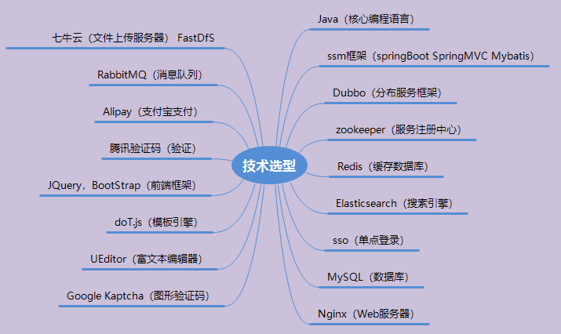

# 乐购商城项目总结

## 一、商品分类管理

### 1.功能汇总

### 2.项目简介

后台管理系统：管理商品、订单、类目、商品规格属性、用户管理以及内容发布等功能。

### 3.技术选型

### 4.环境配置核心流程

#### 4.1.shop父模块

Maven提供了聚合类型的项目，其本质就是一个分布式架构。
		Maven分布式架构-聚合类型，需要一个parent项目，shop-parent就是parent项目。

##### 4.1.1.创建父项目

##### 4.1.2. 编辑pom.xml配置文件

#### 4.2.shop-common子模块

用于添加公共的工具类、枚举类、拦截器等。

##### 4.2.1. 创建shop-manager项目

##### 4.2.2. 编辑pom.xml配置文件

#### 4.3.shop-manager子模块

##### 4.3.1. 创建shop-manager项目

##### 4.3.2. 编辑pom.xml配置文件

#### 4.4.商品管理页面

#### 4.5.MyBatis逆向工程generator的使用

##### 4.5.1. 创建一个generator项目

generator本身和我们商城项目没有关联，所以可以单独新建为一个Project，这边也做成Maven聚合项目里的一个子项目

##### 4.5. 2.添加依赖

##### 4.5.3. 编写mybatis-generator.xml配置文件

### 5.商品分类-新增分类-级联查询

#### 5.1.Service服务层

## 二，商城门户系统

### 1.功能汇总

### 2.项目简介

商城门户系统，前台页面，用户访问的页面

### 3.环境配置核心流程

#### 3.1.搭建前台系统（门户系统）shop-portal

#### 3.2.pom.xml以及application.yml文件

#### 3.3.搭建dubbo（远程服务调用）shop-rpc

#### 3.4.pom.xml以及application.yml文件

### 4.门户系统功能实现

#### 4.1.shop-rpc 核心流程

缓存查找流程
             1.根据key 查询缓存数据
             2.如果缓存存在
                  获取缓存数据返回
             3.如果缓存不存在
                  到数据库查询数据
             4.如果数据库记录存在
                 将数据存入缓存
              5.返回结果

​          业务实现流程(无缓存)
​         1.查询所有的一级节点分类数据  gcv01List
​                parentId=0 and level=1
​          2.循环遍历 gcv01List 获取一级节点数据
​          3.根据一级节点id 查询所有的二级节点数据 gcv02List
​             4. 循环遍历 gcv02List 获取二级节点数据
​             5. 根据二级节点id 查询所有的三级节点数据 gcv03List
​             6. 设置每一级children 属性值

#### 4.2核心代码

##### 4.2.1.GoodsCategoryService.Java（shop-rpc）

##### 4.2.2.shop-portal-controller的GoodsCategoryController.java（shop-portal）

#### 4.3.显示效果

### 5.商城搜索功能实现

#### 5.1. 商品搜索远程RPC服务编写

##### 5.1.1. 添加搜索服务依赖

shop-parent的pom.xml

shop-rpc的pom.xml

#### 5.2.商城搜索服务核心流程

##### 5.2.1.shop-rpc  searchServiceImpl

##### 5.2.2.shop-portal模块单元测试完成远程搜索服务

##### 5.2.3.门户系统搜索页面处理

将 搜索.html 修改名称为 doSearch.ftl 并放入pages/search/doSearch.ft;

#### 5.3.显示效果

## 三、单点登录系统

### 1.功能汇总

### 2.项目简介

#### 2.1. 什么是单点登录？

单点登录（Single Sign On），简称为 SSO，是目前比较流行的企业业务整合的解决方案之一。
		SSO的定义是在多个应用系统中，用户只需要登录一次就可以访问所有相互信任的应用系统。

#### 2.2.实现机制（原理）

当用户第一次访问应用系统的时候，因为还没有登录，会被引导到认证系统中进行登录；根据
用户提供的登录信息，认证系统进行身份校验，如果通过校验，应该返回给用户一个认证的凭据
——ticket；用户再访问别的应用的时候，就会将这个ticket带上，作为自己认证的凭据，应用系统接受到请求之后会把ticket送到认证系统进行校验，检查ticket的合法性。如果通过校验，用户就可以在不用再次登录的情况下访问应用系统2和应用系统3了。

​	要实现SSO，需要以下主要的功能：
（1）所有应用系统共享一个身份认证系统。
（2）统一的认证系统是SSO的前提之一。认证系统的主要功能是将用户的登录信息和用户信息库相比较，对用户进行登录认证；认证成功后，认证系统应该生成统一的认证标志（ticket），返还给用户。另外，认证系统还应该对ticket进行效验，判断其有效性。所有
应用系统能够识别和提取ticket信息。
（3）要实现SSO的功能，让用户只登录一次，就必须让应用系统能够识别已经登录过的用户。应用系统应该能对ticket进行识别和提取，通过与认证系统的通讯，能自动判断当前用户是否登录过，从而完成单点登录的功能。

### 3.环境配置核心流程

#### 3.1.创建项目shop-sso

pom.xml和application.yml

#### 3.2. shop-generator生成t_admin的pojo、mapper

修改shop-generator项目的配置文件，运行util工具类生成t_admin表的pojo、mapper

#### 3.3. 添加SSO 远程服务

SSOService.Java

SSOServiceimpl.Java

### 4.远程登录功能实现

#### 4.1.登录核心流程

1.参数校验

​		userName   password 非空
​		2.用户记录存在查询

​		根据用户名查询用户记录
​		3.密码校验
​    			MD5(password+盐值)
​		4.生成票据并存储(redis) 默认失效时间30min
  			 ticket
​		4.返回票据

​		生成票据并存储到redis

#### 4.2.登录核心代码

##### 4.2.1.UserServiceImpl.Java

##### 4.2.2.后端管理系统编写Controllerego-manager的UserController.java

##### 4.2.3.后端管理退出登录

##### 4.2.4.门户系统登录代码

##### 4.2.5.门户系统退出登录

#### 4.3.登录效果

##### 4.3.1.后端管理单点登录

4.3.2.门户系统单点登录

### 5.登录图形验证码

#### 5.1.验证码核心代码

##### 5.1.1.shop-manager的ImageController.java

##### 5.1.2. 页面处理  shop-manager的login.ftl

#### 5.2.显示效果

##### 5.2.1.shop-manager

##### 5.2.2.shop-portal

